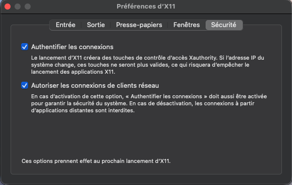

# So_long

## Macos Apple silicon

Macos X11 for so_long

Requirement :

- Docker desktop : [Download here](https://docs.docker.com/desktop/setup/install/mac-install/)
- XQuartz :
	- Via Homebrew -> `brew install --cask xquartz`
	- Manual -> [Xquartz website](https://www.xquartz.org/) download `.pkg`.

After you need to change some setitings in Xquartz :
- Launch Xquartz > `CMD + ,` > Security tab
- Check `Authenticate connections` and `Authorize network client connections`
- **IMPORTANT** Restart Xquartz (Quit with `CMD + q` and relaunch it) for changes to take effect.

<br/>
*The screenshot above shows the settings in French, but the checkboxes should be in the same place :^)*


- Open terminal and run (**Run it in your macos terminal not inside the devcontainer**)
```sh
xhost +localhost
```
NOTE : xhost command it's **volatile** if you reboot or Quit Xquartz you need to retype the command.

Expected output:
```sh
localhost being added to access control list
```

Now you can run your docker
```sh
docker ps
docker exec -it <ID> bash
```
And execute the program.

## dev 

- [x] Hook (ESC and close window)
- [x] Map checker (flood fill)
- [x] Display Map
- [ ] Count move shell